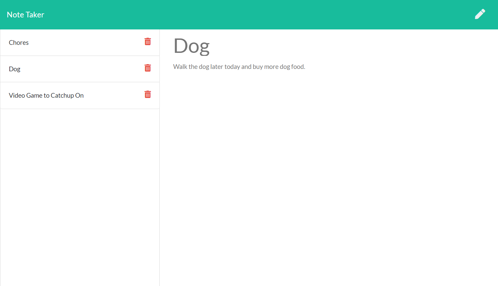
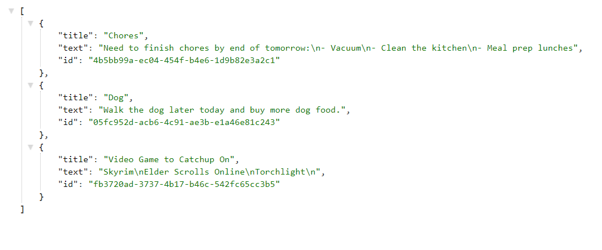

# Note Taker

  

  ## Description
  Note Taker is an app that you can create as many notes as you would like to keep track of to keep yourself organized. These notes will save and each note can be deleted as well.
  For every note created, there is a note title section and a note title section.

  This is a full-stack app which the back-end portion was created with Node.js and Express.js, and the front-end portion using JavaScript, CSS and Bootstrap.

  #### Note Taker app with saved notes:
  

  #### JSON file of the saved notes:
  

  ## Table of Contents 
  - [Usage](#usage)
  - [Tech Used](#tech-used)
  - [Questions](#questions)
  - [Links](#links)
  - [License](#license) 
  
  ## Usage
  - **Create Note**
    - Click the pen icon in the upper right corner to enter a new note
    - Enter your note's title in the "Note Title" section
    - Enter your note's text content in the "Note Text" section
    - When ready to save your note, click the disk icon in the upper right corner
  - **Edit Note**
    - To edit a previosuly created note, click on a note's title in the left hand column to display that note
    - Click on the title and text content areas to edit
  - **Delete Note**
    - If you'd like to delete a certain note, click on the trash can icon next to that note's title on the left hand column

  ## Tech Used
  
  - [Node.js](https://nodejs.org/en/)
  - [Express.js](https://expressjs.com/)
  - [UUID](https://www.npmjs.com/package/uuid)
  - [Bootstrap](https://getbootstrap.com/)
  - [Font Awesome](https://fontawesome.com/start)
  
  ## Questions
  Please visit my **[GitHub profile](https://github.com/tchestnut85/)** to check out this and other projects I've created and contributed to.
  If you have any specific questions about this project, please contact me at <tchestnut85@gmail.com>.

  ## Links
  - **[GitHub Repo](https://github.com/tchestnut85/note-taker/)**
  - **[Deployed App](https://note-taker-001.herokuapp.com/)**

  ## License
  
  
  This app is licensed under the MIT license.
